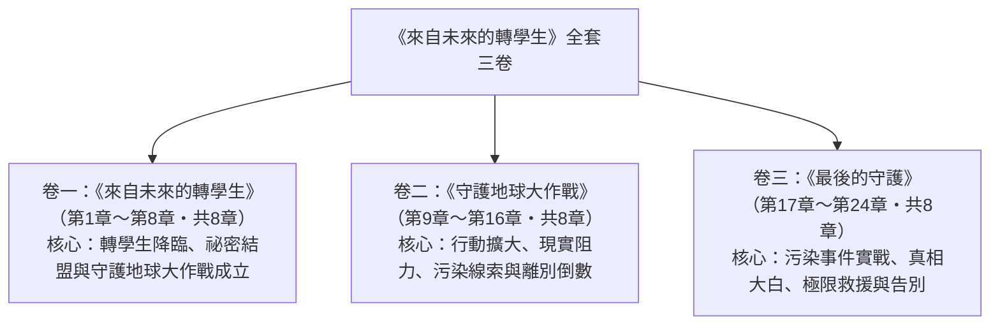

# 《來自未來的轉學生》全套書結構規劃書
## 卷數劃分、章節結構與每卷人物表

---

## 📌 一、基本設定盤點

- **書名**：《來自未來的轉學生》（英文：*The Transfer Student from the Future*）
- **類型**：校園溫馨喜劇 / 環保教育 / 時空冒險 / 成長友情長篇小說
- **目標讀者群**：主力為國小中高年級～國中生（9–15歲），兼顧全年齡層讀者。
- **舞臺背景**：位於台中市龍井區海邊的 **鹿陽國小 六年一班**（全校聞名的王牌皮蛋班，全班人數 **26 人**）。學校後方是海堤與排水溝，海邊的方向矗立著台中火力發電廠五根紅白大煙囪。
- **核心設定**：
  - 來自約四十年後破碎地球的轉學生「林未晞」，帶著未來裝置「時序手環」回到現在。
  - 使命：喚醒現在的人們重視環境，拯救被溫室效應與污染摧殘的未來。
  - 核心引信：時序手環能量有限、持續倒數；未晞偶發「未來幻視」；手環可投影未來環境影像、偵測當前環境數據。
  - 班級核心小組：綝耘晴（晴晴）、轆慄釁（阿釁）、巫茞輆（老巫）、AI 智慧小寵物「溜溜」。
  - 貫穿全書的大計畫：**守護地球大作戰**。
- **反派定義**：本作沒有邪惡魔王，真正的反派是**現實中的環保議題**（溫室效應、塑膠污染、水源與空氣污染、食物浪費等），並以「未來幻象」與「偷排廢水的工廠」作為具體化身。
- **中英對照規則**：全系列章節均配備相同檔名加 `_EN` 的英文版，並保持嚴格的段落 1:1 對齊。

---

## 📚 二、全套書結構規劃：三卷本（三部曲）

全套書規劃為**共 3 卷（三冊）**，每卷 **8 章**，全系列共計 **24 章**。

---

## 📖 三、各卷詳細章節綱要

### 卷一：《來自未來的轉學生》（共 8 章）
> **主題軸心**：神秘的轉學生降臨，未來幻象與破綻初現，班長晴晴以科學調查揭開真相，祕密同盟成立，守護地球大作戰發起。

- **第 1 章：轉學生的到來**
  - 轉學生林未晞降臨六年一班。她溫柔安靜卻「知道太多」：預言下午會下雨、看出哪根水管要壞、說出午餐青菜的產地。全班驚奇，晴晴起疑，溜溜偵測到她手腕上的異常能量波動。
- **第 2 章：手腕上的倒數光環**
  - 午休時未晞獨處，時序手環突然投影出被污染的未來景象，她驚慌壓制。晴晴瞥見一閃而過的畫面。班上議論：學校後方排水溝最近飄出怪味。
- **第 3 章：班長晴晴的科學調查**
  - 晴晴蒐集證據：未晞對天氣、水質、作物的預測精準到不合理；溜溜回報未晞身上有「非地球現有頻段」的訊號。放學後晴晴跟蹤未晞到公園，看見她對著乾枯的樹木低語、眼眶泛紅。
- **第 4 章：祕密同盟成立**
  - 晴晴主動攤牌，未晞坦白身世：來自約四十年後破碎的地球，帶著時序手環回到現在，任務是喚醒大家重視環境。晴晴決定成為她唯一的盟友，祕密同盟成立。
- **第 5 章：未來投影與垃圾分類大作戰**
  - 未晞用手環給晴晴看未來投影：被淹沒的城市、灰黃的天空、堆滿垃圾的海岸。晴晴深受震撼，策動全班展開「垃圾分類大作戰」。周嚴主任認為不務正業，保守阻力初現。
- **第 6 章：午餐零浪費行動**
  - 老巫帶頭響應「把午餐吃光光」運動，統計剩食量，發現學校一天浪費的食物量大得驚人。溜溜充當「午餐偵察兵」。
- **第 7 章：省電節能與植樹認養**
  - 班級發起省電大作戰與校園植栽認養。未晞分享未來缺水缺電的生活，同學們開始有感。阿釁貢獻鬼點子宣傳。
- **第 8 章：守護地球大作戰成立（第一幕高潮）**
  - 全班 26 人投票通過，正式成立「守護地球大作戰」環保大計畫。周嚴主任雖質疑卻默默觀察。幕末：時序手環能量悄悄下降一格，倒數開始，只有晴晴注意到。

---

### 卷二：《守護地球大作戰》（共 8 章，第 9～16 章）
> **主題軸心**：行動從校內擴大到家庭與社區，現實阻力（保守派、部分家長）浮現，環境污染的線索悄然逼近，離別倒數開始被發現。

- **第 9 章：把環保帶回家**
  - 全班把行動推廣到家庭與社區：省電、減塑、回收。部分家長反彈，覺得耽誤課業，晴晴與未晞面對質疑。
- **第 10 章：淨灘行動與塑膠危機**
  - 全班到河岸淨灘，撿到堆積如山的塑膠垃圾。未晞觸發嚴重的未來幻視，情緒潰堤，被阿釁撞見，點子王開始起疑。
- **第 11 章：溜溜的異常偵測**
  - 溜溜偵測到學校附近水質數值異常：學校後方排水溝上游疑似有可疑管線。環境危機的真相悄然逼近。
- **第 12 章：全校綠色園遊會**
  - 全班舉辦「綠色園遊會」募款兼宣導環保。周嚴主任由質疑轉為默許，邱校長大力支持，全校響應。
- **第 13 章：未晞的未來記憶與倒數**
  - 未晞陷入嚴重的未來記憶閃回，身體不適。晴晴發現她手環內側出現不斷縮小的倒數數字，偷偷記下，開始焦慮。
- **第 14 章：阿釁的發現與同盟擴大**
  - 阿釁憑直覺與線索拼湊出真相，晴晴讓他加入，祕密同盟擴為三人（未晞、晴晴、阿釁）。老巫渾然不覺，繼續開心地吃午餐。
- **第 15 章：水源異味蔓延**
  - 學校飲水機的水開始出現怪味，學校後方排水溝污染擴散，有學生身體不適。周嚴主任著手調查，全班鎖定上游可疑工廠管線。
- **第 16 章：污染警報（第二幕高潮）**
  - 水質檢測證實上游有偷排廢水，來自工業區一家食品加工廠。祕密同盟決定設法揭發，全校進入警戒。幕末：手環倒數數字急遽縮小。

---

### 卷三：《最後的守護》（共 8 章，第 17～24 章）
> **主題軸心**：真實污染事件實戰，祕密真相大白，全班結成最強同盟，用行動拯救水源與天空；離別倒數的最後時刻，笑中帶淚的告別。

- **第 17 章：追查偷排管線**
  - 祕密同盟深入調查污染源，阿釁、晴晴、老巫、溜溜全員出動，未晞以時序手環偵測定位管線。工廠老闆開始暗中阻撓。
- **第 18 章：真相大白**
  - 全班 26 人發現未晞的秘密，從震驚到接受，全班結成「守護地球大作戰・全員出動」。離別倒數進入最後階段。
- **第 19 章：空汙紅害警報**
  - 工廠為湮滅證據加劇排放，學校周邊空汙紅害，天空灰黃。未晞的幻視越來越頻繁，能量耗損加速。
- **第 20 章：極限蒐證行動**
  - 全班用平日所學的環保知識與未來科技，冒險蒐集工廠偷排的證據，對抗工廠老闆的阻撓。
- **第 21 章：揭發與拯救**
  - 證據在全校面前公開，污染源被勒令停工，社區水源與天空獲得解救。周嚴主任、邱校長全力護航。
- **第 22 章：倒數最後的時刻**
  - 拯救成功後，時序手環能量即將歸零。未晞必須在時空節點關閉前回到未來，否則時空錯亂、所有人都會消失。全班 26 人得知離別迫在眉睫，痛哭不捨。
- **第 23 章：奇蹟的告別**
  - 最後時刻，全班用「守護地球大作戰」的成果與孩子們的承諾為未晞送行，象徵希望被傳遞下去。未晞含淚道別，時序之門開啟。
- **第 24 章：明天見，未晞！（全劇大結局）**
  - 未晞帶著孩子們的承諾回到未來；多年後，未來的地球因為當年的行動而出現轉機。鹿陽國小六年一班的同學們在校門口齊聲高呼「明天見，未晞！」，全劇圓滿落幕。

---

## 👥 四、各卷人物表（Character Rosters）

### 🌟 貫穿全劇的核心人物（全三卷皆在場）

| 角色名稱 | 角色定位 | 特色與道具 | 全劇主線功能 |
| :--- | :--- | :--- | :--- |
| **林未晞** （未來轉學生） | 第一主角 六年一班轉學生 | 時序手環（投影未來幻象、環境偵測、歸返關鍵）、未來幻視、未來知識。 | 從未來回到現在喚醒環保意識，被晴晴發現祕密後結盟，發起守護地球大作戰，最後必須返回未來。 |
| **綝耘晴** （晴晴） | 女主角 班長 / 理工少女 | 隨身測量工具、數據分析、縝密觀察力。 | 最先發現未晞祕密的人，祕密同盟核心，負責守密、分析環境數據與統籌大作戰。 |
| **轆慄釁** （阿釁） | 核心夥伴 點子王 | 天馬行空的鬼點子、強大行動力。 | 第 10 章起加入祕密同盟，負責宣傳與行動指揮，把環保玩成全校大事。 |
| **巫茞輆** （老巫） | 核心夥伴 體育股長 / 吃貨 | 大胃王體格、無窮體力、人緣極佳。 | 帶動午餐零浪費與校內行動的重量級號召者，以樸實的信任默默支持未晞。 |
| **溜溜** | 班級 AI 智慧小寵物 | 似鼠似狐、超高速、高敏感雷達、情報王。 | 第一個察覺未晞異常能量的小夥伴；負責監測水質、空氣與可疑管線，關鍵時刻叼走證物、拉警報。 |
| **周嚴** （黑面判官） | 學務主任 | 違規登記簿、鷹隼般銳利的眼神。 | 前期質疑孩子搞環保「不務正業」，後期被真實付出感動，轉為最強力護航的體制內盟友。 |

---

### 卷一人物表（聚焦轉學生降臨與祕密結盟）

| 角色名稱 | 陣營/身分 | 性格與特色 | 本卷關鍵戲份 |
| :--- | :--- | :--- | :--- |
| **林未晞** | 未來轉學生 | 溫柔堅毅、知道太多未來的轉學生。 | 降臨六年一班，手環投影未來，被晴晴發現祕密。 |
| **綝耘晴（晴晴）** | 六年一班班長 | 冷靜理工少女。 | 科學調查揭開祕密，與未晞結成祕密同盟。 |
| **轆慄釁（阿釁）** | 六年一班點子王 | 調皮搞笑。 | 貢獻鬼點子宣傳環保行動，尚未得知祕密。 |
| **巫茞輆（老巫）** | 六年一班吃貨 | 憨厚開心果。 | 帶動午餐零浪費行動。 |
| **溜溜** | AI 小寵物 | 機敏靈活。 | 最先偵測到未晞身上異常能量波動。 |
| **周嚴** | 學務主任 | 嚴格重視秩序成績。 | 質疑孩子搞環保不務正業，保守阻力初現。 |
| **邱守仁** | 鹿陽國小校長 | 和藹愛泡茶。 | 對守護地球大作戰好奇並默默觀察。 |

---

### 卷二人物表（聚焦行動擴大與污染線索）

| 角色名稱 | 陣營/身分 | 性格與特色 | 本卷關鍵戲份 |
| :--- | :--- | :--- | :--- |
| **林未晞** | 未來轉學生 | 因未來記憶閃回身體不適，手環倒數開始。 | 淨灘時幻視潰堤被阿釁撞見，祕密同盟擴大為三人。 |
| **綝耘晴（晴晴）** | 班長 / 祕密盟友 | 冷靜縝密。 | 發現手環內側縮小的倒數數字，開始焦慮；舉辦綠色園遊會。 |
| **轆慄釁（阿釁）** | 點子王 / 新盟友 | 直覺敏銳。 | 拼湊出真相加入同盟，策畫園遊會與宣傳。 |
| **溜溜** | AI 小寵物 | 情報偵察兵。 | 偵測到水質異常與上游可疑管線，鎖定污染源。 |
| **周嚴** | 學務主任 | 由質疑轉為默許。 | 見證孩子們的付出，態度軟化；水源異味蔓延時著手調查。 |
| **部分家長** | 家庭端阻力 | 重視升學、懷疑環保耽誤課業。 | 在家庭與學校製造現實阻力，後被感動。 |
| **邱守仁** | 鹿陽國小校長 | 和藹支持。 | 大力支持綠色園遊會，全校響應。 |

---

### 卷三人物表（聚焦污染實戰與離別）

| 角色名稱 | 陣營/身分 | 性格與特色 | 本卷關鍵戲份 |
| :--- | :--- | :--- | :--- |
| **林未晞** | 未來轉學生 | 使命與離別倒數交織，能量將盡。 | 用時序手環定位管線，真相大白後必須返回未來。 |
| **綝耘晴（晴晴）** | 班長 / 祕密盟友 | 冷靜堅定。 | 統籌極限蒐證行動，主導揭發與拯救。 |
| **轆慄釁（阿釁）** | 點子王 | 行動指揮。 | 率全班對抗工廠阻撓，冒險蒐證。 |
| **巫茞輆（老巫）** | 吃貨 / 體力擔當 | 憨厚可靠。 | 用體力與人緣守住陣線，見證真相。 |
| **溜溜** | AI 小寵物 | 關鍵偵察兵。 | 叼走關鍵證物，在最後時刻為未晞送行。 |
| **周嚴** | 學務主任（盟友） | 原則堅定。 | 由質疑徹底轉為全力護航，與邱校長一起守護孩子與水源。 |
| **工廠老闆** | 污染源化身 | 為利益漠視環境的縮影。 | 偷排廢水、阻撓蒐證，最終被揭發停工。 |
| **六年一班全體 26 人** | 畢業生 / 最強同盟 | 各展所長。 | 真相大白後全班總動員，最後含淚送別未晞。 |
