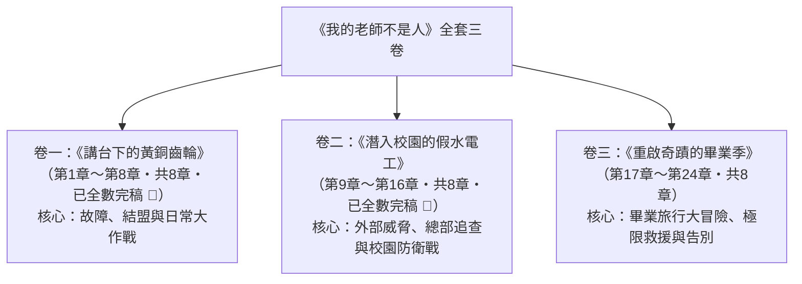

# 《我的老師不是人》全套書結構規劃書
## 卷數劃分、章節結構與每卷人物表

---

## 📌 一、現有資料與進度整理

### 1. 基本設定盤點
- **書名**：《我的老師不是人》（英文：*My Teacher Is Not Human*）
- **類型**：校園爆笑喜劇 / 輕度科幻冒險 / 溫馨成長長篇小說
- **目標讀者群**：主力為國小中高年級～國中生（9–15歲），兼顧全年齡層童趣讀者。
- **舞臺背景**：鹿陽國小 **六年一班**（全校聞名的傳奇皮蛋班，**全班人數共 26 人**）。
- **核心設定**：
  - 教育部與先端未來科技的秘密試驗專案（Project P.E.D.A.）。
  - 全能教育仿生機器人「GS-X01」，化名為實習導師「高峙舷」。
  - 核心引信：寫黑板時掉落【P.E.D.A. Core-Gear #03】黃銅行星齒輪（常識與修辭調節器脫落），觸發「絕對字面解析模式」及偶發機能外洩（指尖加熱、頭頂冒煙等）。
  - 班級核心小組：轆慄釁（阿釁）、綝耘晴（晴晴）、巫茞輆（老巫）、AI 智慧小寵物「溜溜」。
- **中英對照規則**：全系列章節均配備相同檔名加 `_EN` 的英文版，並保持嚴格的段落 1:1 對齊。

### 2. 現有已完成章回（中英雙語皆已完稿，嚴格 1:1 對齊）
- **第 1 章：六年一班的新救星**（高老師單手接粉筆灰盒，透視書包，預言肉包賞味期）
- **第 2 章：黑板前的「鏗啷」聲**（齒輪掉落，字面解析啟動，皮尺量腰圍防扁平化填充）
- **第 3 章：老師的字面理解症**（教室烤箱翻面事件，笑掉大牙拔牙加固危機，溜溜敲鐘救場）
- **第 4 章：器材室的祕密手術**（撞見散熱風扇與光纖主機板，坦白仿生身分，晴晴修復齒輪，六年一班秘密同盟結成）
- **第 5 章：乾冰舞台劇大救援**（高老師超載頭頂冒白煙，溜溜示警，全班演白雪公主迷霧掩護黑面主任）
- **第 6 章：指尖微波爐與營養午餐傳奇**（高老師手指微波加熱肉包，全校瘋傳氣功；洗碗精滑水道大掃除引發泡泡衝浪狂歡）
- **第 7 章：超次元健康操風暴**（大會操程式混淆跳出極限機械舞，全校跟跳街舞狂歡，邱校長盛讚全腦開發健康操）
- **第 8 章：期中考的透視光眼**（高老師視網膜投影儀短路直射標準答案，全班閉眼拒看守護老師，全員及格榮獲最佳進步金牌獎，卷一圓滿完結）
- **第 9 章：熱情過頭的家長座談會**（刁鑽家長輪番質詢，高老師真理演算法大實話震驚全場，獲家長熱淚盈眶起立鼓掌；神秘水電工李博士潛入校園）
- **第 10 章：修繕工身上的金屬掃描儀**（彈珠地雷陣與粉筆灰煙幕雙重反擊，高老師指尖微波電磁擊穿燒毀掃描儀，李博士首戰慘敗狼狽撤退）
- **第 11 章：溜溜的緊急空投情資**（溜溜潛入地下通風管截獲李博士總部通訊，偷得晶片並空投鉛筆盒，揭露72小時EMP銷毀通牒與4mm行星軸承危機）
- **第 12 章：六年一班校園游擊戰**（四大戰術小隊洗碗精彈珠滑道、粉筆灰煙幕彈與假信號引開李博士，高老師微波空手奪白刃燒毀短路槍，游擊戰大獲全勝）
- **第 13 章：失衡的第二枚軸承**（副軸承磨損破 91%，高老師太空步倒退行走與語言倒序，全班集體太空步掩護周主任巡堂，右側動力癱瘓啟動極限搶救）
- **第 14 章：深夜實驗室的零件尋寶**（回收場聲東擊西引開校警，阿釁晴晴夜潛自然實驗室，微型挑針磁鑷極限拆解超高速離心機取得 4mm 鈦合金軸承，黑面判官持手電筒逼近）
- **第 15 章：黑面判官的深夜巡邏**（周主任持鹵素手電筒逼近，老巫野性貓叫與溜溜空投橡皮青蛙引開黑面判官，全員七點前衝回器材室驗證軸承）
- **第 16 章：短暫的平靜與危機陰影**（器材室深夜手術成功更換軸承，高老師機能完全重啟；假水電工李博士被校長終止合約逐出校門；董事會批准歐米茄協議鎖定畢業旅行日展開強制回收，卷二圓滿完結）
- **第 17 章：出發！最後的畢業旅行**（高老師發放 26 份防扁平包，車廂純機械合成兩隻老虎遺傳學兒歌，指尖微波肉包拯救午餐，全員抵達未來極限樂園，李博士重裝伏擊卡車就位）
- **第 18 章：遊樂園的機械之神**（老巫地鼠機受挫，高老師雙槌極限48連擊刷爆99999分溢位冒白煙抱回太空金熊；光線槍50發全中十環、太空巨爪連抓23隻包辦全班26隻巨型布偶；暴風雨黑雲壓境，李博士潛入供電總站裝載定時電磁短路器，天際雲霄飛車大危機一觸即發）
- **第 19 章：暴風雨中的雲霄飛車**（強對流暴風雨襲來，李博士引爆變電站EMP，過山車30公尺頂峰80度垂直軌道斷電卡死；狂風暴雨中機械卡榫崩裂滑墜30公分，周主任持大喇叭泥濘咆哮護生；高老師指令晴晴剪開後背縫線手動拔環，解除安全協議解鎖100%全功率，跨出車廂踏上垂直鋼軌展開極限救援）
- **第 20 章：解鎖百分之百全功率**（自鎖棘輪碎裂列車失控俯衝，高老師徒手合金扣死導向輪爆發超新星電弧；衣袖碎裂露出水銀機械臂，雙眼化為金紅核能光柱；胸口噴湧三米白龍蒸汽逆向推車，全班26人整齊後仰吶喊「一二推」協同發力，周主任泥濘暴吼助威；列車越過稜線安全錨定全員生還，高老師電量耗盡雙眼暗下陷入休眠）
- **第 21 章：耗盡能源的沉睡老師**（高老師西裝襤褸雙眼暗淡休眠，全班26人圍聚痛哭；晴晴檢測核心電壓歸零、三號傳動軸承熱膨脹卡死，因缺少鎖定螺帽無法強行安裝齒輪以免永久格式化記憶；溜溜尾巴閃紅警報，李博士率十二名重裝特勤攜低溫隔離箱登頂強行回收；阿釁老巫帶領26名學生手挽手築起人牆護師，周主任手持實心鐵管咆哮破門殺到）
- **第 22 章：大雨中的人牆防線**（周主任怒擲教師證持鐵管震懾李博士，26名學生牽手築起鋼鐵人牆誓死護師；李博士檢視黑盒子情感溢位紀錄震撼淚崩，下令撤退並交付除錯隨身碟與鈦合金扳手，揭露12分鐘電容歸零倒數；專用左旋反牙螺帽墜入鋼構深淵，溜溜躍入風雨搜尋搶救）
- **第 23 章：奇蹟的最後一顆齒輪**（12分鐘電容倒數極限搶救，全班人肉帳篷擋風擋雨，溜溜暴雨深淵銜回反牙螺帽，阿釁交出胸前齒輪，晴晴泥濘微米手術，齒輪完美咬合重啟，高老師宣告全員合格）
- **第 24 章：明天見，高老師！（全劇大結局）**（畢業典禮大圓滿，高老師幽默大數據分析評語，阿釁獲最佳齒輪保管員特等榮譽，全班贈予刻滿26人名字的26齒鏡面黃銅齒輪珍藏胸口，夕陽校門口深情相約「明天見」）

---

## 📚 二、全套書結構規劃：三卷本（三部曲）

考量少兒與青少年長篇小說出版的黃金規格（每冊約 2.5 萬～3.5 萬字、8 個章節、閱讀負擔適中且高潮明快），全套書規劃為**共 3 卷（三冊）**，每卷 **8 章**，全系列共計 **24 章**。

---

## 📖 三、各卷詳細章節綱要

### 卷一：《講台下的黃銅齒輪》（共 8 章，已全數完稿 🎉）
> **主題軸心**：神級機器人導師降臨，齒輪意外脫落引發字面解讀狂暴，六年一班皮蛋們從「作對」變成「全力掩護」的搞笑日常。

- **第 1 章：六年一班的新救星**（已完成 ✅）
- **第 2 章：黑板前的「鏗啷」聲**（已完成 ✅）
- **第 3 章：老師的字面理解症**（已完成 ✅）
- **第 4 章：器材室的祕密手術**（已完成 ✅）
- **第 5 章：乾冰舞台劇大救援**（已完成 ✅）
- **第 6 章：指尖微波爐與營養午餐傳奇**（已完成 ✅）
- **第 7 章：超次元健康操風暴**（已完成 ✅）
- **第 8 章：期中考的透視光眼（卷一高潮）**（已完成 ✅）

---

### 卷二：《潛入校園的假水電工》（共 8 章，第 9～16 章・已全數完稿 🎉）
> **主題軸心**：研發科技公司發現數據異常，李博士化身水電工潛入校園調查；同時面臨最嚴苛的家長座談會，全班展開校園游擊防禦。

- **第 9 章：熱情過頭的家長座談會**（已完成 ✅）
- **第 10 章：修繕工身上的金屬掃描儀**（已完成 ✅）
- **第 11 章：溜溜的緊急空投情資**（已完成 ✅）（溜溜在地下室截獲李博士總部通訊並奪取數據膠囊，空投鉛筆盒揭露72小時銷毀通牒與4mm行星軸承危機）
- **第 12 章：六年一班校園游擊戰**（已完成 ✅）（四大戰術小隊發動彈珠陣與粉筆灰煙幕引向黑面主任，高老師字面防禦空手奪槍燒毀短路器，游擊戰大獲全勝）
- **第 13 章：失衡的第二枚軸承**（已完成 ✅）（高老師副軸承磨損達91.2%右側下肢癱瘓，課堂月球漫步與語言倒帶，全班集體逆向太空步神級掩護黑面主任，搶修突擊行動提前引爆）
- **第 14 章：深夜實驗室的零件尋寶**（已完成 ✅）（回收場聲東擊西引開校警，阿釁晴晴夜潛自然實驗室，微型挑針磁鑷極限拆解超高速離心機取得 4mm 鈦合金軸承，黑面判官持手電筒逼近）
- **第 15 章：黑面判官的深夜巡邏**（已完成 ✅）（周主任持鹵素強光手電筒突擊實驗室，老巫野性咆哮貓叫干擾，溜溜高空空投橡皮青蛙神級走位引開主任，全員趕在七點防盜警報啟動前攜零件撤回器材室，軸承相容度達 99.8%）
- **第 16 章：短暫的平靜與危機陰影（卷二高潮）**（已完成 ✅）（晴晴深夜器材室極限手術完成軸承置換，高老師伺服重啟；邱校長嚴詞驅逐李博士，全班歡呼；高老師發放安全帽字面防爆，李博士連線董事會啟動歐米茄協議鎖定畢業旅行，卷二大團圓完結）

---

### 卷三：《重啟奇蹟的畢業季》（共 8 章，第 17～24 章）
> **主題軸心**：六年級畢業旅行來到巨型主題樂園，天災人禍下高老師解除限制英勇救人，電量耗盡陷入休眠；全班同心守護，迎向笑中帶淚的畢業。

- **第 17 章：出發！最後的畢業旅行**（已完成 ✅）（全班整裝出發，高老師字面發放 26 份防扁平包，大巴車廂演繹純機械遺傳學版《兩隻老虎》引爆全車狂笑，休息站指尖微波熱包子；抵達未來極限樂園入住星際飯店，李博士率十二名特勤與 EMP 卡車暗夜就位）
- **第 18 章：遊樂園的機械之神**（已完成 ✅）（高老師在打地鼠遊戲中刷爆最高紀錄溢位99999分，幫全班抓齊26隻巨型星際布偶；暴風雨黑雲聚攏，李博士暗中破壞供電總站，天際雲霄飛車大危機逼近）
- **第 19 章：暴風雨中的雲霄飛車**（已完成 ✅）（李博士引爆EMP全園跳電，雲霄飛車卡在30公尺高空80度垂直軌道，暴雨狂風中卡榫斷裂滑墜；周主任持大喇叭咆哮護師生；高老師指示晴晴剪開縫線拔除拉環，解鎖100%全功率踏上垂直鋼軌）
- **第 20 章：解鎖百分之百全功率**（已完成 ✅）（高老師徒手硬扣失控車架，噴湧白熾蒸汽逆推6.5噸車廂攀登80度垂直軌道；全班集體後仰協同發力，列車安全錨定避難月台，全員生還；高老師能量耗盡雙眼熄滅休眠）
- **第 21 章：耗盡能源的沉睡老師**（已完成 ✅）（高老師電量歸零軸承熱卡死陷入休眠；李博士率特勤隊登頂強行回收，全班26人手挽手築起人牆死守；周主任持實心鐵管咆哮殺入護師生）
- **第 22 章：大雨中的人牆防線**（已完成 ✅）（周主任怒持生鐵水管與教師證挺身護師生，26名學生牽手築起鋼鐵人牆；李博士檢視黑盒子飛行數據被真摯情感震撼淚崩，下令全員撤退並交付除錯隨身碟與微調扳手，揭露12分鐘電容歸零倒數；專用左旋反牙螺帽墜入鋼構深淵，溜溜躍入暴雨展開極限搜救）
- **第 23 章：奇蹟的最後一顆齒輪**（已完成 ✅）（全班26人築起人肉防雨帳篷，溜溜三十米鋼構深淵銜回特製反牙螺帽；阿釁解下佩戴一年的黃銅齒輪，晴晴跪在泥濘中以微米級精度完成齒輪組裝與鎖定；電容歸零瞬間系統自檢重啟，高老師溫暖金藍雙眼綻放，宣告六年一班全員合格）
- **第 24 章：明天見，高老師！（全劇大結局）**（已完成 ✅）（畢業典禮盛大舉行，高老師頒發專屬幽默大數據畢業評語，阿釁獲頒最佳齒輪保管員特等榮譽證書；全班26人回贈親手車削刻滿26人名字的黃銅齒輪，高老師珍藏於心臟口袋；夕陽校門口齊聲許下「明天見，高老師！」的最美承諾，全書圓滿完結）

---

## 👥 四、各卷人物表（Character Rosters）

### 🌟 貫穿全劇的核心人物（全三卷皆在場）

| 角色名稱 | 角色定位 | 特色與武器/道具 | 全劇主線功能 |
| :--- | :--- | :--- | :--- |
| **高峙舷** （GS-X01） | 男主角 六年一班班導 | 西裝筆挺、黑框眼鏡、指尖微波加熱、胸口散熱蜂巢扇。 | 掉齒輪後觸發「字面解讀狂魔」，但逐漸演化出保護六年一班的真正情感。 |
| **轆慄釁** （阿釁） | 第一主角 調皮點子王 | 隨身將【Core-Gear #03】串成項鍊戴在胸前、釣魚線、彈珠。 | 掩護作戰總指揮，點子最多，誓死不讓老師被抓走。 |
| **綝耘晴** （晴晴） | 女主角 班長/天才技師 | 家開機車修理行，隨身精密螺絲起子組、絕緣膠帶、膠槌、萬用電表。 | 高老師的地下專屬維修員，負責所有機件調試與緊急手術。 |
| **巫茞輆** （老巫） | 核心夥伴 體育股長/吃貨 | 抽屜永遠備用熱包子、大胃王體格、無窮蠻力。 | 高老師第一鐵粉，在體育與衝突場面擔任肉盾與護衛。 |
| **溜溜** | 班級 AI 智慧小寵物 | 似鼠似狐、尖耳、金屬光澤大尾巴、內建廣播與高敏感雷達。 | 全校情報王，負責動線監控、拉警報、叼零件打掩護。 |
| **周嚴** （黑面判官） | 學務主任 | 違規登記簿、鷹隼般銳利的眼神。 | 前期整天想抓高老師把柄，後期轉化為最強大的體制內護航盟友。 |

---

### 卷一人物表（聚焦班級內部與故障磨合）

| 角色名稱 | 陣營/身分 | 性格與特色 | 本卷關鍵戲份 |
| :--- | :--- | :--- | :--- |
| **高峙舷** | 六年一班導師 | 剛到任的模範教師，精準無比。 | 掉落三號齒輪，開啟字面解讀模式，與學生秘密結盟。 |
| **轆慄釁（阿釁）** | 六年一班學生 | 點子王、調皮鬼隊長。 | 設計粉筆灰機關，撿到關鍵齒輪，策劃全班掩護。 |
| **綝耘晴（晴晴）** | 六年一班班長 | 理工少女，修理天才。 | 用放大鏡鑑定齒輪，器材室幫高老師完成第一次裝配。 |
| **巫茞輆（老巫）** | 六年一班學生 | 吃貨、心寬體胖。 | 肉包被高老師拿去對阿釁「緊急口服防扁填充」。 |
| **溜溜** | AI 小寵物 | 機敏靈活、全班寵物。 | 偵測高老師登場氣場，踩下總電開關提前敲響下課鐘。 |
| **陳阿達** | 六年二班體育生 | 愛打籃球、說話誇張。 | 籃球被高老師單手接住；喊「熱得像烤箱」差點被翻面烘烤。 |
| **尪伝恺** | 六年一班學生 | 笑點極低。 | 笑喊「快笑掉大牙」差點被高老師用牙線強制十字加固。 |
| **林芸芸** | 六年一班學生 | 膽小敏感。 | 第一個發現高老師後腦勺掉零件的小女生。 |
| **周嚴** | 學務主任 | 嚴格執法。 | 第 5 章突擊檢查，差點發現高老師頭頂冒煙。 |

---

### 卷二人物表（聚焦外部威脅與攻防戰）

| 角色名稱 | 陣營/身分 | 性格與特色 | 本卷關鍵戲份 |
| :--- | :--- | :--- | :--- |
| **李博士** （本卷主要對手） | 先端科技研發主管 | 聰明嚴謹、手持高精度探測器，偽裝成校園修繕水電工。 | 潛入校園試圖掃描並回收 GS-X01，被六年一班游擊戰搞得狼狽不堪。 |
| **柯媽媽** | 家長會副會長 | 挑剔嚴苛、名牌包不離手，極度重視升學與紀律。 | 在家長座談會上發難質詢，被高老師用「大實話演算法」徹底折服。 |
| **校長（邱守仁）** | 鹿陽國小校長 | 和藹可親、喜歡泡茶、常常慢半拍。 | 誤以為高老師帶來的機械舞是「創新教育成果」，大力表彰。 |
| **工友老伯（老林）** | 學校真正水電工 | 耳背、熱情，常常找不到自己的板手。 | 工具箱被李博士偷用，意外成為學生反偵查的線索。 |
| **六年一班 26 人軍團** | 全班同學 | 各展所長（黑板擦彈幕組、彈珠滑倒組）。 | 全班同仇敵愾，在走廊與實驗室掩護高老師不被李博士掃描。 |

---

### 卷三人物表（聚焦高潮大營救與終曲）

| 角色名稱 | 陣營/身分 | 性格與特色 | 本卷關鍵戲份 |
| :--- | :--- | :--- | :--- |
| **遊樂園工程主管** | 外部角色 | 在暴風雨跳電時手足無措，試圖封鎖消息。 | 阻擋學生，後目睹高老師徒手攀爬救人驚為天人。 |
| **科技公司特勤回收隊** | 先端科技總部 | 開著黑色封閉式貨車、穿著防靜電服裝的專業工程小組。 | 抵達現場試圖強行將休眠的高老師裝箱運回總部銷毀。 |
| **周嚴（學務主任）** | 護航盟友（關鍵爆發） | 平時黑面嚴肅，但原則是「我的學生和同仁誰也不能隨便帶走！」 | 挺身擋在科技公司大卡車前，出示教師證保衛高老師。 |
| **李博士（心態轉變）** | 先端科技研發主管 | 看到孩子們的眼淚與高老師保護學生的異常底層數據。 | 被震撼並反思科技與教育的意義，最終默許並協助隱瞞總部。 |
| **六年一班全體 26 名同學** | 畢業生 | 滿身泥濘在大雨中築成人牆手牽手。 | 晴晴主刀、阿釁遞零件、溜溜叼螺絲，全員見證奇蹟重啟。 |
