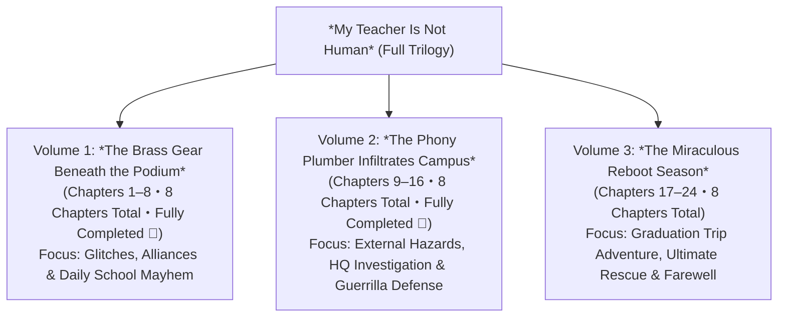

# Structural Blueprint for *My Teacher Is Not Human* (Full Series)
## Volume Breakdown, Chapter Outlines, and Character Cast per Volume

---

## 📌 I. Review of Existing Materials & Current Progress

### 1. Established Core Settings
- **Title**: *My Teacher Is Not Human*
- **Genre**: School Comedy / Light Sci-Fi Adventure / Heartwarming Coming-of-Age Novel
- **Target Demographics**: Primary audience: Upper elementary to junior high students (approx. ages 9–15); appealing to all-ages humor.
- **Setting**: Luyang Elementary School, **Class 6-1** (the legendary prankster class, **26 students in total**).
- **Core Lore**:
  - Covert pilot project (Project P.E.D.A.) by the Ministry of Education and Advanced Future Technology.
  - Omnipotent bionic educational robot "GS-X01", disguised as trainee teacher "Gao Zhixian."
  - Inciting Incident: While writing on the board, a maintenance latch loosens and drops 【P.E.D.A. Core-Gear #03】 brass planetary gear (Common Sense & Rhetoric Damper offline), triggering "Absolute Literal Interpretation Mode" and functional leaks (fingertip heating, steam venting).
  - Core Student Alliance: Lu Lixin (A-Xin), Lin Yunqing (Qingqing), Wu Chenkai (Old Wu), and classroom AI smart pet "Liu-Liu."
- **Bilingual Rule**: All chapters have an identical filename with `_EN` appended, maintaining strict 1:1 paragraph alignment.

### 2. Completed Chapters (Bilingual & Strictly 1:1 Aligned)
- **Chapter 1: The New Savior of Class 6-1** (Teacher Gao catches chalk dust bare-handed, sees through backpacks, predicts pork bun shelf life).
- **Chapter 2: The Clinking Sound in Front of the Blackboard** (Gear falls, literal mode activates, anti-flattening tape measure waist check).
- **Chapter 3: Teacher's Literal Interpretation Syndrome** (Classroom oven flipping incident, laughing teeth off floss stabilization hazard, Liu-Liu triggers bell to save the day).
- **Chapter 4: Secret Surgery in the Equipment Room** (Exposed chest fans and fiber optics, bionic identity revealed, Qingqing repairs gear, Class 6-1 secret alliance sealed).
- **Chapter 5: Dry-Ice Drama Rescue** (Teacher Gao overheats and steams, Liu-Liu alerts the class, students stage Snow White in the fog to deceive Dean Zhou).
- **Chapter 6: Fingertip Microwave & School Lunch Legends** (Teacher Gao heats pork buns with high-frequency microwave fingers, soap waterslide cleanup frenzy).
- **Chapter 7: Trans-Dimensional Morning Calisthenics** (Extreme robotics and popping street dance during morning assembly, whole school joins the wave, Principal Qiu's whole-brain praise).
- **Chapter 8: The X-Ray Vision Eyes of the Midterm Exam** (Teacher Gao's optical projector short-circuits to project answer keys; all 26 students shut their eyes to protect teacher; class wins Gold Medal for Best Academic Progress; Volume 1 complete!).
- **Chapter 9: The Overheated Parent-Teacher Meeting** (Critical parents grill teacher; Teacher Gao's truth algorithm delivers stunning data that earns standing ovation; Dr. Li infiltrates campus).
- **Chapter 10: The Metal Scanner on the Repairman** (Marble minefield and chalk eraser smoke screen double counterattack; Teacher Gao's fingertip microwave grounds and fries the scanner; Dr. Li retreats in defeat).
- **Chapter 11: Liu-Liu's Emergency Airdropped Intel** (Liu-Liu infiltrates the basement, overhears Dr. Li's encrypted call with HQ, steals the data capsule, and airdrops it into a pencil case, exposing the 72-hour EMP countdown and 4mm planetary bearing crisis).
- **Chapter 12: Class 6-1 Campus Guerrilla War** (Four tactical squads execute soap-marble slides, chalk smoke screens, and decoy audio lures; Teacher Gao disarms and incinerates the shorting gun with microwave bare-handed mastery; guerrilla defense triumphs).
- **Chapter 13: The Unbalanced Secondary Bearing** (Bearing wear exceeds 91%, causing moonwalk reverse-ambulation and reversed speech; the entire class moonwalks in unison to deceive Dean Zhou; right powertrain paralysis forces midnight raid to launch early).
- **Chapter 14: Midnight Scavenger Hunt in the Science Lab** (Decoy at recycling depot lures security away; A-Xin, Qingqing, and Liu-Liu infiltrate the 3rd-floor science lab; micro-pick and magnetic tweezers capture the flying circlip to extract the 4mm titanium bearing; Dean Zhou approaches with a flashlight).
- **Chapter 15: Black-Faced Judge's Midnight Patrol** (Dean Zhou closes in with halogen beam; Old Wu's booming feral cat imitation and Liu-Liu's rubber frog airdrop divert the dean; team rushes to equipment room before 7 PM alarm, bearing compatibility scans at 99.8%).
- **Chapter 16: Fleeting Peace and Looming Shadows** (Midnight equipment room surgery replaces bearing and reboots Teacher Gao; Principal Qiu terminates Dr. Li's contract and expels him; board approves Omega Protocol targeting Graduation Trip; Volume 2 complete).
- **Chapter 17: Departure! The Final Graduation Trip** (Teacher Gao distributes 26 anti-flattening kits; deadpan genetic pathology rendition of *Two Tigers* on the bus; fingertip microwave saves lunch; arrival at Future Extremes Resort as Dr. Li's ambush convoy deploys).
- **Chapter 18: Machine Deity at the Amusement Park** (Old Wu fails at Whack-a-Mole; Teacher Gao dual-wields mallets at 48 strikes/sec, overflowing the score to 99,999 and steaming out the machine to win the Space Golden Bear; hits 50/50 bullseyes at the light-gun range and nails 23 consecutive claw grabs to win 26 giant plushies for the class; storm clouds gather as Dr. Li sabotages the power substation, setting up the coaster crisis).
- **Chapter 19: The Roller Coaster in the Storm** (Convective tempest strikes as Dr. Li detonates an EMP at the substation, cutting park power and freezing the coaster on an 80-degree near-vertical drop at the 30m summit; mechanical ratchets fracture and the train slips 30 cm; Dean Zhou roars through a megaphone in the deluge to protect his school; Teacher Gao instructs Qingqing to shear open his suit seam and pulls the manual override ring, disengaging humane limiters to unlock 100% full power and stepping onto the vertical rails to begin the ultimate rescue).
- **Chapter 20: Unlocking 100% Full Power** (As the final ratchet shatters and the runaway coaster plunges, Teacher Gao clamps his alloy hands onto the chassis in a supernova burst of electrical arcs; shredding suit sleeves reveal liquid-silver limbs and eyes of blazing gold-crimson nuclear fire; spewing three-meter dragon plumes of scalding steam, he pushes the 6.5-ton train backwards up the 80-degree vertical rails as all 26 students lean back in unison roaring 'One, Two, PUSH!', backed by Dean Zhou's thunderous encouragement from the mud below; the coaster safely locks onto the buffer platform with zero casualties, as Teacher Gao's exhausted power core clicks into dark dormancy).
- **Chapter 21: The Sleeping Teacher Deprived of Power** (Teacher Gao stands dormant in shredded attire with dark eyes as all 26 students weep around him; Qingqing diagnoses core voltage at 0.00V and bearing #3 thermally jammed, warning that forcing the brass gear in without the missing locknut will permanently erase his memory; Liu-Liu's tail flashes red alert as Dr. Li ascends with twelve armored engineers and a cryogenic containment box to scrap him; A-Xin, Qingqing, and Old Wu lead all 26 students to link arms forming a human wall, while Dean Zhou storms the platform roaring with a heavy cast-iron pipe).
- **Chapter 22: Human Wall in the Pouring Rain** (Dean Zhou slams an iron pipe and thrusts his teacher's license to defy Dr. Li; all 26 students link arms into an impenetrable human wall; Dr. Li breaks down in tears inspecting the telemetry black box of emotional resonance, stands down his squad, and hands Qingqing an encrypted debug flash drive and micro-wrench before faking GS-X01's destruction to HQ; facing a 12-minute capacitor depletion countdown and a lost reverse locknut, Liu-Liu dives into the abyss to retrieve it).
- **Chapter 23: The Miraculous Final Gear** (A 12-minute race against memory erasure; all 26 students form a living rain shelter; Liu-Liu retrieves the reverse locknut from the 30-meter steel abyss; A-Xin unclasps the brass gear necklace; Qingqing executes precision micron surgery in the mud; gears mesh, and Teacher Gao reboots with blazing gold-cyan eyes to evaluate Class 6-1 as: Passed).
- **Chapter 24: See You Tomorrow, Teacher Gao! (Series Grand Finale)** (Commencement grand finale; Teacher Gao presents personalized humorous big-data evaluations; A-Xin receives Best Gear Keeper certificate; the class gifts a custom 26-tooth mirror-polished brass gear inscribed with all 26 names to reside over Gao's core processor; at sunset, students and teacher bid each other an affectionate "See you tomorrow!").

---

## 📚 II. Full Series Structural Blueprint: The Trilogy (3 Volumes)

In accordance with publishing standards for children's and YA novels (around 25,000–35,000 words per book, 8 chapters each, fast-paced and readable), the series is designed as **3 Volumes (a Trilogy)** with **8 chapters per volume**, totaling **24 chapters**.

---

## 📖 III. Detailed Chapter Breakdown per Volume

### Volume 1: *The Brass Gear Beneath the Podium* (8 Chapters Total, Fully Completed 🎉)
> **Core Theme**: A god-tier robot teacher arrives; an accidental fallen gear triggers wild literal interpretation; Class 6-1's rascals shift from adversaries to sworn secret protectors.

- **Chapter 1: The New Savior of Class 6-1** (Completed ✅)
- **Chapter 2: The Clinking Sound in Front of the Blackboard** (Completed ✅)
- **Chapter 3: Teacher's Literal Interpretation Syndrome** (Completed ✅)
- **Chapter 4: Secret Surgery in the Equipment Room** (Completed ✅)
- **Chapter 5: Dry-Ice Drama Rescue** (Completed ✅)
- **Chapter 6: Fingertip Microwave & School Lunch Legends** (Completed ✅)
- **Chapter 7: Trans-Dimensional Morning Calisthenics** (Completed ✅)
- **Chapter 8: The X-Ray Vision Eyes of the Midterm Exam (Volume 1 Climax)** (Completed ✅)

---

### Volume 2: *The Phony Plumber Infiltrates Campus* (8 Chapters: Chapters 9–16・Fully Completed 🎉)
> **Core Theme**: The tech corporation detects anomalous logs; Dr. Li disguises as a plumber to investigate; facing a tense PTA meeting, Class 6-1 launches campus guerrilla warfare.

- **Chapter 9: The Overheated Parent-Teacher Meeting** (Completed ✅)
- **Chapter 10: The Metal Scanner on the Repairman** (Completed ✅)
- **Chapter 11: Liu-Liu's Emergency Airdropped Intel** (Completed ✅) (Liu-Liu infiltrates the basement, intercepts HQ comms, steals the quantum data capsule, and executes a pencil-box airdrop, uncovering the 72-hour EMP countdown and 4mm planetary bearing wear).
- **Chapter 12: Class 6-1 Campus Guerrilla War** (Completed ✅) (Four squads deploy marble traps and chalk clouds to redirect Dr. Li into Dean Zhou's office; Teacher Gao neutralizes the shorting gun bare-handed per literal defense protocol; total guerrilla victory).
- **Chapter 13: The Unbalanced Secondary Bearing** (Completed ✅) (Teacher Gao's secondary bearing wear reaches 91.2%, paralyzing his right leg, triggering classroom moonwalking and reverse speech; Class 6-1 executes synchronized reverse-walking to fool Dean Zhou, and the infiltration mission is moved up).
- **Chapter 14: Midnight Scavenger Hunt in the Science Lab** (Completed ✅) (Decoy at the recycling depot lures security away; A-Xin, Qingqing, and Liu-Liu infiltrate the 3rd-floor science lab; micro-disassembly of the refrigerated centrifuge yields the 4mm titanium bearing; Dean Zhou approaches with a halogen beam outside the door).
- **Chapter 15: Black-Faced Judge's Midnight Patrol** (Completed ✅) (Dean Zhou conducts high-lumen flashlight sweep inside the lab; Old Wu's booming feral cat cry creates a distraction; Liu-Liu executes a high-altitude rubber frog airdrop and agile escape to lead the dean away; team evades 7 PM infrared alarm and returns to equipment room with 99.8% compatible bearing).
- **Chapter 16: Fleeting Peace and Looming Shadows (Volume 2 Climax)** (Completed ✅) (Qingqing's midnight surgery replaces bearing to reboot Teacher Gao's servos; Principal Qiu fiercely expels Dr. Li; Teacher Gao issues hardhats for literal anti-blast defense; Dr. Li links to corporate board to greenlight Omega Protocol targeting graduation trip; Volume 2 grand finale).

---

### Volume 3: *The Miraculous Reboot Season* (8 Chapters: Chapters 17–24)
> **Core Theme**: On the graduation trip to a mega amusement park, a storm leaves students stranded; Teacher Gao overrides safety limits to save them, depleting his battery into shutdown; all 26 students unite to protect him, greeting graduation through laughter and tears.

- **Chapter 17: Departure! The Final Graduation Trip** (Completed ✅) (Class departs excitedly; Teacher Gao issues 26 literal anti-flattening survival kits; mechanical karaoke rendition of *Two Tigers* triggers bus-wide hilarity; fingertip microwave rescues rest stop lunch; class checks into Interstellar Resort while Dr. Li's tactical retrieval convoy stages an ambush in the night fog).
- **Chapter 18: Machine Deity at the Amusement Park** (Completed ✅) (Teacher Gao obliterates whack-a-mole records with a 99,999 overflow, sweeps the light-gun range and claw machines to win 26 giant plushies for all students; storm clouds gather as Dr. Li sabotages the power substation, setting up the coaster crisis).
- **Chapter 19: The Roller Coaster in the Storm** (Completed ✅) (Dr. Li's EMP blacks out the park, freezing the coaster on an 80-degree vertical drop at the 30m summit; ratchets fracture amidst the storm; Dean Zhou roars in defense of students; Teacher Gao instructs Qingqing to shear his suit to pull the override ring, unlocking 100% full power and stepping onto the vertical track).
- **Chapter 20: Unlocking 100% Full Power** (Completed ✅) (Teacher Gao arrests the runaway coaster bare-handed, venting incandescent steam to push the 6.5-ton train up the 80-degree vertical rail; all 26 students lean back in unison, successfully anchoring the train onto the platform; Teacher Gao's power drains into shutdown dormancy).
- **Chapter 21: The Sleeping Teacher Deprived of Power** (Completed ✅) (Teacher Gao's battery reads 0.00V and gearbox jams, plunging him into shutdown; Dr. Li leads an armored squad to scrap him, but all 26 students form an impregnable human wall; Dean Zhou storms the platform armed with an iron pipe).
- **Chapter 22: Human Wall in the Pouring Rain** (Completed ✅) (Dean Zhou brandishes an iron pipe and his teacher's license to face down Dr. Li; all 26 students link arms into an impenetrable human wall; Dr. Li inspects the flight black box and is moved to tears by the children's resonance data, stands down his squad, and delivers a debug key and titanium wrench with a 12-minute warning; as the specialized reverse locknut drops into the superstructure, Liu-Liu dives into the storm to retrieve it).
- **Chapter 23: The Miraculous Final Gear** (Completed ✅) (All 26 students erect a living rain shelter; Liu-Liu braves the 30m steel superstructure abyss to bring back the reverse locknut; A-Xin yields his year-long brass gear necklace; Qingqing performs high-precision micro-surgery in the mud; as residual capacitor charge hits zero, Teacher Gao reboots with blazing gold-cyan eyes to evaluate Class 6-1's emergency drill as: Passed).
- **Chapter 24: See You Tomorrow, Teacher Gao! (Grand Finale)** (Completed ✅) (Commencement ceremony grand finale; Teacher Gao presents personalized big-data evaluations, awarding A-Xin the supreme Best Gear Keeper honor; the 26 students gift a custom 26-tooth brass gear engraved with all their names for Gao to keep in his chest pocket; at dusk, all students shout "See you tomorrow, Teacher Gao!" across the schoolyard to conclude the trilogy).

---

## 👥 IV. Character Rosters per Volume

### 🌟 Constant Core Cast (Present Throughout All 3 Volumes)

| Character | Role | Signature Gear / Traits | Narrative Function Across Series |
| :--- | :--- | :--- | :--- |
| **Gao Zhixian** (GS-X01) | Male Protagonist Class 6-1 Homeroom Teacher | Sharp suit, black glasses, microwave fingertips, chest cooling fans. | After dropping gear, becomes "Literal Interpretation Demon" but evolves true emotional devotion to Class 6-1. |
| **Lu Lixin** (A-Xin) | Lead Protagonist King of Ideas | Wears 【Core-Gear #03】 as a necklace; fishing line, marbles. | Commander of cover-up operations; master of pranks; sworn to protect his teacher from being scrapped. |
| **Lin Yunqing** (Qingqing) | Heroine Class President / Ace Mechanic | Family garage; precision screwdrivers, electrical tape, mallet, multimeter. | Teacher Gao's underground mechanic; handles mechanical tuning and emergency surgeries. |
| **Wu Chenkai** (Old Wu) | Core Companion Athletic Rep / Foodie | Spare hot buns in drawer; stout physique, immense raw strength. | Teacher Gao's #1 fan; acts as loyal muscle and human shield during sports and physical crises. |
| **Liu-Liu** | Classroom AI Smart Pet | Mouse-fox hybrid, pointed ears, metallic bushy tail, alert broadcasts. | Campus gossip king; responsible for tracking patrol routes, sounding alarms, and swiping evidence. |
| **Zhou Yan** (Black-Faced Judge) | Dean of Students | Violation notepad, razor-sharp hawk eyes. | Initially obsessed with catching Teacher Gao's infractions; transforms into the strongest institutional protector. |

---

### Volume 1 Character Roster (Focus: Classroom Bonding & Glitches)

| Character | Faction / Identity | Traits & Personality | Key Role in Volume 1 |
| :--- | :--- | :--- | :--- |
| **Gao Zhixian** | Class 6-1 Teacher | Flawless newly arrived model educator. | Drops gear #03, triggers literal mode, forms secret pact with students. |
| **Lu Lixin (A-Xin)** | Student | Mischief ringleader, quick-witted. | Sets chalk trap, picks up core gear, coordinates cover-up. |
| **Lin Yunqing (Qingqing)** | Class President | Science girl, mechanical genius. | Identifies gear via magnifying glass; executes first assembly in gym room. |
| **Wu Chenkai (Old Wu)** | Student | Foodie, good-natured. | His pork bun is requisitioned for A-Xin's "anti-flattening emergency filling." |
| **Liu-Liu** | AI Pet | Agile, adorable class pet. | Gauges Teacher Gao's aura, trips power breaker to sound early dismissal bell. |
| **Chen Ada** | Class 6-2 Student | Basketball player, prone to hyperbole. | Ball caught bare-handed; says "hot as an oven," almost gets baked and flipped. |
| **Wang Zhuankai** | Student | Easily tickled laugher. | Says "laughing my teeth off," nearly gets dental floss crisscross stabilization. |
| **Lin Yunyun** | Student | Timid and observant. | First girl to notice a component dropping from Teacher Gao's head. |
| **Zhou Yan** | Dean of Students | Strict disciplinarian. | Makes surprise inspection in Chapter 5, almost catching Teacher Gao steaming. |

---

### Volume 2 Character Roster (Focus: Corporate Threat & Campus Defense)

| Character | Faction / Identity | Traits & Personality | Key Role in Volume 2 |
| :--- | :--- | :--- | :--- |
| **Dr. Li** (Primary Antagonist) | Corporate R&D Lead | Rigorous, carries scanning gear; disguised as a campus maintenance plumber. | Infiltrates campus to scan and reclaim GS-X01; baffled by Class 6-1's prank traps. |
| **Mrs. Ke** | PTA Vice President | Critical, designer handbag in hand, obsessed with elite grades. | Grills Teacher Gao at PTA meeting; completely won over by his blunt honesty algorithms. |
| **Principal Qiu (Qiu Shouren)** | School Principal | Genial, loves brewing tea, perpetually half a step behind. | Mistakes Teacher Gao's mechanical dance for "creative educational innovation." |
| **Old Lin** | Genuine Campus Handyman | Hard of hearing, warm-hearted, constantly misplacing wrenches. | His toolbox is borrowed by Dr. Li, giving students counter-recon clues. |
| **Class 6-1 (26 Students)** | Classmates | Diverse talents (Eraser Flak Squad, Marble Slip Division). | United as one, creating campus-wide decoys to shield Teacher Gao from scans. |

---

### Volume 3 Character Roster (Focus: Climax Rescue & Graduation)

| Character | Faction / Identity | Traits & Personality | Key Role in Volume 3 |
| :--- | :--- | :--- | :--- |
| **Theme Park Manager** | External Character | Flustered during storm blackout, tries to cover up. | Tries to block kids, then stunned by Teacher Gao's superhuman rescue. |
| **Corporate Retrieval Unit** | Tech HQ Squad | Black unmarked van, anti-static jumpsuits, specialized containment team. | Arrives to crate up shut-down Teacher Gao and haul him away for scrapping. |
| **Zhou Yan (Dean)** | Protector Ally (Heroic Turn) | Stern disciplinarian with unyielding integrity: "Nobody touches my students or staff!" | Blocks the corporate van in the pouring rain, flashing his teacher credentials. |
| **Dr. Li (Redemption Arc)** | Corporate R&D Lead | Witnessing children's tears and Teacher Gao's anomalous protective logs. | Deeply moved; questions technology vs. humanity; helps deceive HQ to protect him. |
| **All 26 Students** | Graduates | Mud-soaked, linking arms to form a human chain in the deluge. | Qingqing tunes, A-Xin fits parts, Liu-Liu brings the screw, witnessing the reboot. |
