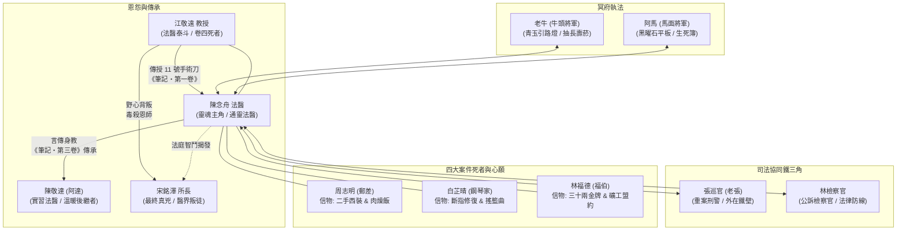

# 《頭七解剖室：台灣法醫的最後心願筆記》全書人物介紹
## The Seventh Day in the Morgue: Character Profiles

---

## 目錄
1. [核心主角群（陽界司法人員與法醫傳承者）](#1-核心主角群陽界司法人員與法醫傳承者)
2. [陰界引渡執法者（幽冥地府使者）](#2-陰界引渡執法者幽冥地府使者)
3. [卷一關鍵人物：新莊雨夜郵差案（母子深情與市井尊嚴）](#3-卷一關鍵人物新莊雨夜郵差案母子深情與市井尊嚴)
4. [卷二關鍵人物：淡水豪門琴鍵斷指案（母愛夜曲與殘孫尋親）](#4-卷二關鍵人物淡水豪門琴鍵斷指案母愛夜曲與殘孫尋親)
5. [卷三關鍵人物：金瓜石金礦塵肺案（三十年礦工生死盟約）](#5-卷三關鍵人物金瓜石金礦塵肺案三十年礦工生死盟約)
6. [卷四關鍵人物：解剖台上的恩師案（法醫天職與跨國黑幕）](#6-卷四關鍵人物解剖台上的恩師案法醫天職與跨國黑幕)
7. [全書人物關係與信物象徵總覽](#7-全書人物關係與信物象徵總覽)

---

## 1. 核心主角群（陽界司法人員與法醫傳承者）

### 陳念舟（Chen Nian-zhou）
* **身分定位**：新北市地檢署專任特約法醫、本書靈魂主角、「通靈法醫」、《無聲者筆記》第二代繼承人。
* **外貌與特質**：三十歲中旬，眼眶常年帶著淡淡的疲倦烏青，身著洗得泛白的手術刷手服或防護袍，指尖帶著消毒水與淡長壽菸草的混雜氣息。神情冷峻自持、寡言寡語，但在解剖台前的手術刀法精準如雕刻藝術。
* **特殊能力**：在死者死後 168 小時（頭七）之內，透過「頭七通靈」的特異體質，於第四解剖室的夜霧中與亡魂相見，代死者完成未竟的心願，並以死者回饋的關鍵物理病理線索作為突破口，在法庭上將兇手繩之以法。
* **經典信物**：
  * **11 號解剖手術刀**：握柄刻有「慎微」二字，是恩師江敬遠親手贈予的佩刀。
  * **黃長壽香菸**：思考案情與敬奠陰陽兩界時點燃的菸草。
  * **《無聲者筆記》**：黑色硬皮厚筆記本，記錄著每位亡魂的最後遺願與鑑識真相。
* **人物金句**：「解剖刀切開的是皮肉與骨骼，但縫合起來的，是人間不甘的尊嚴與公道。」

---

### 陳敬達（阿達，Chen Jing-da / A-Da）
* **身分定位**：新北市地檢署法醫室菜鳥實習法醫、陳念舟的唯一正式關門弟子。
* **外貌與特質**：二十五歲，圓臉娃娃臉，來自雲林北港農家。初登場時容易緊張乾嘔、手忙腳亂，但性格赤誠堅韌、心思極度細膩敏銳。
* **成長歷程**：從一開始連鋸開顱骨都會雙手發抖的菜鳥，在歷經周志明案、白芷晴案、金瓜石案的震撼教育後，逐漸學會「直面死亡而不麻木、同理亡者而不崩潰」。在卷四恩師遭害、念舟身心俱疲時，阿達頂住巨大壓力獨立執行關鍵氣管組織切片，並在最後被念舟託付《無聲者筆記・第三卷》，成為法醫界新一代的守護者。
* **經典信物**：
  * **北港朝天宮天上聖母平安符**：掛在脖子上的紅線布符，沾染著福馬林與香灰氣息。
  * **排骨雞風味泡麵**：解剖室值夜班時必備的心靈慰藉。
* **人物金句**：「老師，我雖然手會抖，但我手上的刀絕對不會偏！因為死者在等我們替他說話！」

---

### 張巡官（老張，Inspector Zhang）
* **身分定位**：新北市刑警大隊重案偵查隊小隊長、陳念舟多年來的辦案黃金拍檔。
* **外貌與特質**：五十多歲老刑警，皮膚粗糙黝黑，習慣將警用制服襯衫挽到手肘，滿嘴檳榔渣與道地台語黑話。表面看似粗枝大葉、辦案雷厲風行，實則經驗豐富、眼光毒辣，極度護短且充滿江湖正義感。
* **在團隊中的作用**：法醫鑑識的「人間鐵臂」。念舟在解剖室發現蛛絲馬跡，老張便能憑藉龐大的警政人脈與街頭線索在 24 小時內火速將嫌犯抓捕歸案。深知念舟解剖室裡的「神祕規矩」，從不多問，但永遠在最關鍵時刻扛住高層施壓。
* **經典信物**：雙冬檳榔、泛黃的警徽皮套。

---

### 林檢察官（Prosecutor Lin）
* **身分定位**：新北地檢署公訴組檢察官、法理鐵壁。
* **特質**：冷靜理性、嚴守程序正義。她要求每一份證據鏈都必須達到「超越合理懷疑」的無瑕標準，最初對念舟偶爾展現的「神準直覺」抱持懷疑，但隨著念舟每一次都拿出無懈可擊的微物病理證據，林檢成為地檢署內力挺念舟團隊的最強法律後盾。

---

### 江敬遠（Professor Chiang Ching-yuan）
* **身分定位**：台灣法醫病理學界泰斗、陳念舟的引路恩師、《無聲者筆記・第一卷》的創始作者、卷四核心死者。
* **特質與影響**：性格溫潤儒雅而剛直不阿，曾任法務部法醫研究所顧問。三十年來堅持「法醫是死者的最後律師」。因拒絕為跨國黑心製藥集團背書毒疫苗假鑑定，遭到親傳弟子宋銘澤以精密隱蔽的醫療微創手術穿刺胃壁毒殺。
* **經典信物**：
  * **老式金邊鋼筆**：筆尖微磨平，用於批改學生解剖報告。
  * **《無聲者筆記・第一卷》**：記載台灣早期重大疑案與頭七通靈鐵律的奠基筆記。
* **人物金句**：「念舟，刀要利，但心要軟。我們聽見亡者的聲音，不是因為我們有神通，而是因為亡者知道，只有我們肯停下來聽。」

---

## 2. 陰界引渡執法者（幽冥地府使者）

### 老牛（牛頭將軍，General Ox-Head）
* **身分定位**：幽冥地府勾魂引渡執法長官、陽間與陰界的中介引渡者。
* **形象**：常以高大魁梧、披著黑色厚重老式風衣的硬漢形象現身，風衣下隱現古老斑駁的青銅重鎧。面部輪廓剛硬如岩石，頭生微曲暗銅犄角，手持一盞泛著森綠幽芒的青玉引路燈。
* **性格特質**：外表冷酷如玄鐵、惜字如金，動輒搬出「陰律森嚴，逾時魂飛魄散」的鐵則威嚇，但私底下極為重情重義。他欽佩陳念舟為無辜冤魂洗刷不甘的執著，常在規定的頭七 168 小時邊緣睜一隻眼閉一隻眼，為念舟爭取破案的最後幾分鐘。
* **愛好**：抽陳念舟點燃的陽間黃長壽香菸，稱讚陽間的菸草比黃泉忘川的彼岸花香更有人味。

---

### 阿馬（馬面將軍，General Horse-Face）
* **身分定位**：幽冥地府首席生死簿巡查使者、陰陽兩界資訊化管理者。
* **形象**：相對於老牛的古典威嚴，阿馬展現出兼具賽博科技與冥府幽冥的獨特形象。常戴著能解析因果因緣的全息符文代碼單片眼鏡，手持一塊由黑曜石打磨而成、泛著冷藍陰火的生死簿數位平板。
* **性格特質**：語速極快、毒舌且幽默，熱衷於精算亡魂因果功德點數。雖然表面上常常吐槽陽間刑警辦案效率低落，但在關鍵時刻總能迅速查閱死者輪迴生辰與生前重大因果節點，為念舟指點迷津。

---

## 3. 卷一關鍵人物：新莊雨夜郵差案（母子深情與市井尊嚴）

### 周志明（Chou Chih-ming）
* **身分定位**：三十歲，新莊郵局約聘郵差、卷一死者。
* **性格特質**：老實敦厚、孝順顧家。父親早逝，自幼與以做資源回收與清潔工為生的母親相依為命。即使在狂風暴雨的颱風夜，也堅持要把每一封救急掛號信親手送到收件人手中。
* **死因與遭遇**：因目睹地下錢莊暴力討債現場並拾獲關鍵犯罪帳冊，在風雨交加的深夜遭高利貸集團車輛追撞並毆打致死，屍體被棄置於大漢溪畔爛泥中。
* **遺願**：親手穿上自己省吃儉用為母親攢錢所買下的唯一一套二手平價西裝，吃一碗母親親手煮的「香蔥肉燥飯」，並將最後一封救命掛號信安全送達。

---

### 林秀琴（Lin Hsiu-chin）
* **身分定位**：周志明母親，年近六旬，新莊區公所兼職公廁清潔工。
* **性格特質**：雙手布滿粗糙凍瘡與裂痕，一生窮苦但自尊心極強，始終教導兒子「人可以窮，但骨頭不能軟」。志明遇害後，她在滂沱雨夜中捧著志明最愛的紅糟肉燥飯來到解剖室外守候，其撕心裂肺而隱忍的母愛深深震撼了念舟與阿達。

---

### 梁富生（Liang Fu-sheng）
* **身分定位**：新莊「宏泰融資公司」負責人、地下黑金洗錢集團頭目。
* **性格特質**：殘暴狡詐，自恃政商關係良好，以雨夜視線不佳為由企圖將謀殺包裝為單純肇事逃逸，最終因車底微量油漆碎片與志明指甲縫內的特殊皮膚碎屑被念舟鎖定罪證。

---

## 4. 卷二關鍵人物：淡水豪門琴鍵斷指案（母愛夜曲與殘孫尋親）

### 白芷晴（Pai Chih-ching）
* **身分定位**：二十二歲，台北市立交響樂團特約青年鋼琴家、卷二死者。
* **特質**：氣質清冷典雅，天賦異稟。出身三重貧民窟違章鐵皮屋，由單親母親打三份工賣力撫養長大。其右手中指在遇害時遭兇手惡意折斷粉碎，象徵著藝術夢想被豪門權貴無情踐踏。
* **死因**：因拒絕豪門闊少趙凌雲的迷姦與強迫包養，並威脅公開其吸毒狂歡錄音，於淡水河畔豪宅遭趙凌雲勒斃拋屍。
* **遺願**：希望念舟為其修復斷指，讓她能以完好雙手在陰陽交界彈奏最後一遍母親教她的《山櫻花搖籃曲》與蕭邦《降E大調夜曲》。

---

### 趙凌雲（Chao Ling-yun）
* **身分定位**：淡水「宏遠航運集團」少東、鋼琴家案真兇。
* **特質**：表面上是英俊瀟灑的政商名流接班人，背地裡性格變態暴虐、視底層人命如草芥。作案後動用龐大家族律師團企圖湮滅監視器並嫁禍他人，最終念舟從其手腕隱蔽處提取出芷晴生前最後抓傷的 DNA，鐵證如山。

---

### 薑茶阿嬤（Grandma Ginger Tea）
* **身分定位**：七十六歲，北港朝天宮廟口老婦人。
* **背景故事**：二十五年前，其四歲愛孫在廟會人潮中遭人口販子拐走失蹤，阿嬤走遍全台、二十五年如一日在冬夜熬煮黑糖薑茶發放給流浪漢與香客，只盼有一天孫子能尋著薑茶香氣回家。其悲願感染了同為北港人的阿達，最終在念舟透過無名屍資料庫的比對下，解開了一樁跨越四分之一世紀的骨骼身分之謎。

---

## 5. 卷三關鍵人物：金瓜石金礦塵肺案（三十年礦工生死盟約）

### 林福德（福伯，Uncle Fu-te）
* **身分定位**：七十三歲，金瓜石本山五坑退休採礦班長、卷三死者。
* **性格特質**：沉默如山、信守承諾。一生吸入巨量礦坑二氧化矽粉塵，罹患重度第四期塵肺病。三十年前，五坑發生嚴重瓦斯爆炸透水慘劇，四十一名前線採礦工為了替後方爭取逃生時間，集體將最後一口氧氣讓給了福伯，並將淘金攢下的三十兩黃金託付給他，約定用於撫養所有礦工遺孤。
* **死因**：因堅決不肯交出黃金與坑道採礦權以阻擋黑心財團強拆，遭到財團買兇縱火，重度吸入性肺損傷致死。
* **遺願**：親手將三十兩純金打造的金牌，交給結拜兄弟陳茂森唯一的十二歲聾啞盲孫女「阿妹」。

---

### 阿妹（A-Mei）
* **身分定位**：十二歲，天生聾啞少女、陳茂森遺孤、福伯相依為命的養孫女。
* **特質**：雖然無法說話，但雙眼清澈如山泉。對老舊坑道的敲擊聲有著超乎常人的敏銳感應。在福伯頭七之夜，念舟與阿達在金瓜石坑道深處替福伯完成託孤盟約，阿妹用雙手撫摸福伯冰冷的面容，喊出了人生中第一聲撕心裂肺的「阿公」。

---

### 陳金彪（Chen Chin-piao）
* **身分定位**：金瓜石「金山休閒觀光育樂公司」負責人、地方黑道角頭。
* **特質**：貪婪殘暴，企圖將本山五坑改建為違法地下賭場與高級度假村，以工業液壓油潑灑縱火燒死福伯，最終念舟從死者肺部碳黑微粒中分析出特殊工業油料光譜，老張循線將其逮捕。

---

## 6. 卷四關鍵人物：解剖台上的恩師案（法醫天職與跨國黑幕）

### 宋銘澤（Dr. Sung Ming-tse）
* **身分定位**：台灣大學醫學院毒理學研究所所長、江敬遠教授的大弟子、全書最終反派真兇。
* **外貌與特質**：四十多歲，金絲眼鏡、衣冠楚楚、風度翩翩的明星醫學學者。智商極高、城府極深，對法醫鑑識技術了若指掌。
* **動機與犯罪手法**：為了數億元的跨國黑心製藥集團利益與政治前途，企圖逼迫恩師江敬遠簽署毒疫苗偽造鑑定報告；遭拒絕後，精心策劃了一場「完美謀殺」——利用自製微創軟式胃鏡穿刺，將超微量神經毒素直接注入江教授後腹腔神經節，偽裝成突發性心因性猝死。
* **結局**：自以為天衣無縫，但念舟在頭七倒數最後三小時，憑藉恩師亡魂以手指沾血留下的「胃小彎」密碼，聯手阿達進行顯微紅外光譜組織切片，在法庭公聽會上當眾揭穿其偽善面具。

---

## 7. 全書人物關係與信物象徵總覽

### 核心人物關係網

### 全書關鍵象徵信物表

| 象徵信物 | 持有者 / 關聯人物 | 象徵意涵 | 出現關鍵篇章 |
| :--- | :--- | :--- | :--- |
| **刻字 11 號解剖刀** | 江敬遠 $\rightarrow$ 陳念舟 | 象徵法醫追求真理的鋒芒與「慎微」的敬畏心。 | 全書貫穿（卷一至卷四） |
| **《無聲者筆記》** | 江敬遠 $\rightarrow$ 陳念舟 $\rightarrow$ 阿達 | 象徵死者尊嚴的記錄、正義精神在台灣世代之間的薪火相傳。 | 全書貫穿（最終章交接） |
| **長壽香菸（黃長壽）** | 陳念舟、老牛 | 陽世煙火與幽冥冷鐵的交界點，是陽間人情味的最質樸慰藉。 | 全書貫穿 |
| **北港朝天宮平安符** | 陳敬達（阿達） | 象徵來自民間基層最樸素的善念與保護力，代表阿達不滅的赤子之心。 | 全書貫穿 |
| **二手平價西裝** | 周志明、林秀琴 | 象徵市井小人物在貧窮命運面前絕不妥協的尊嚴與孝道。 | 卷一第 1~4 章 |
| **修復的右手中指** | 白芷晴 | 象徵純粹藝術與靈魂的完整，不受權貴暴力的折辱。 | 卷二第 5~8 章 |
| **三十兩純金礦工金牌** | 林福德、阿妹、41位殉職礦工 | 象徵重於泰山的兄弟生死信義，三十年不渝的血性承諾。 | 卷三第 9~12 章 |
| **胃小彎組織切片** | 江敬遠、陳念舟、宋銘澤 | 象徵天理昭彰，任何精密的偽裝在嚴謹的病理科學面前終將無所遁形。 | 卷四第 13~16 章 |

---
*本人物介紹文檔專為《頭七解剖室：台灣法醫的最後心願筆記》全書完整世界觀與人物檔案留存。*
